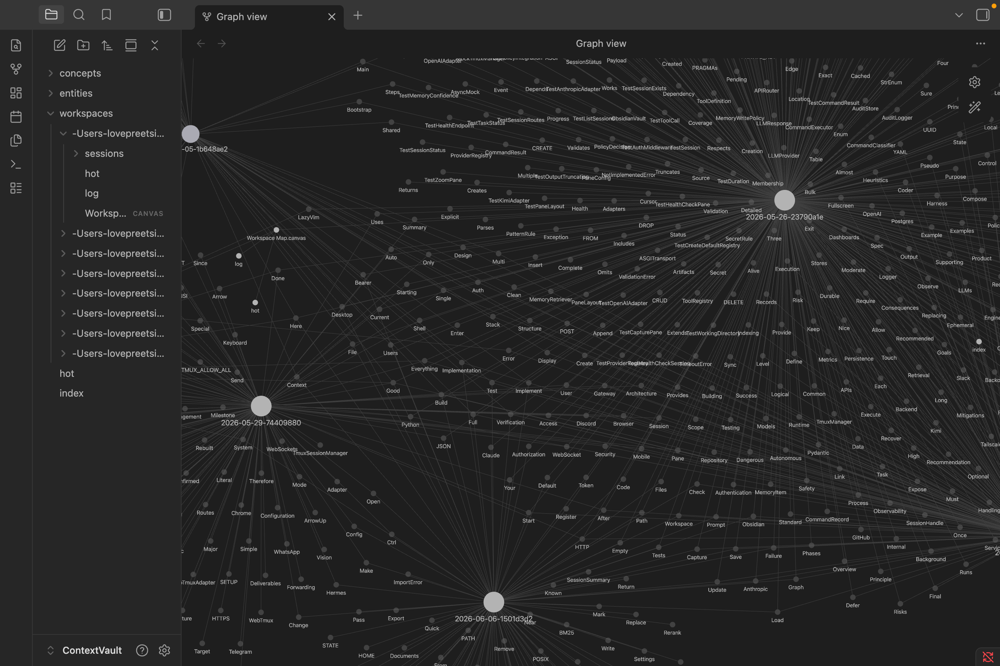

# ContextVault

LLM-agnostic per-workspace memory backed by Obsidian.

ContextVault captures your coding sessions into structured Markdown notes, files them into a knowledge graph in an Obsidian vault, and exposes that vault to any LLM client via MCP or HTTP -- so every new session starts with full context from past work.



## How it works

1. **Captures sessions automatically** -- when a Claude Code turn ends (or a Hermes turn completes), ContextVault extracts: goal, summary, decisions, files touched, commands run, errors and resolutions, open TODOs, and mentioned entities (auto-wikilinked).
2. **Scopes memory per workspace** -- the workspace is your current working directory. Cross-workspace queries are opt-in via `--scope global`.
3. **Builds a knowledge graph** -- Obsidian wikilinks connect sessions to shared entities (people, libraries, APIs) and concepts (frameworks, patterns). Browse the graph in Obsidian's graph view.
4. **Surfaces context to any LLM** -- a single MCP server gives Claude Code, Hermes, and Cursor tools to `recall` past sessions, `save_note`, `list_workspaces`, `lint`, and more.
5. **Privacy-first** -- extraction is deterministic and offline by default. Secret patterns (AWS keys, bearer tokens, JWT, `KEY=value`) are regex-redacted before they hit disk. LLM-quality summarization is opt-in behind `--allow-egress`.

## Setup

### 1. Install

```bash
git clone git@github.com:singhdevhub-lovepreet/contextvault.git
cd contextvault
python3 -m venv .venv
.venv/bin/pip install -e ".[dev]"
```

Put `contextvault` on your PATH:

```bash
mkdir -p ~/.local/bin
ln -sf "$(pwd)/.venv/bin/contextvault" ~/.local/bin/contextvault
echo 'export PATH="$HOME/.local/bin:$PATH"' >> ~/.zshrc
source ~/.zshrc
```

### 2. Initialise the vault

```bash
contextvault init
# vault:  ~/Documents/ContextVault
# config: ~/.config/contextvault/config.toml
# token:  ~/.config/contextvault/token
```

The vault is a standard Obsidian vault. Open it in Obsidian at any time (File > Open Vault > `~/Documents/ContextVault`).

### 3. Connect your LLM client

#### Claude Code

```bash
contextvault adapter add claude-code
```

This installs hooks into `~/.claude/settings.json`:

- **Stop hook** -- captures the session incrementally after every turn.
- **SessionStart hook** -- loads the workspace hot cache into context.
- **MCP server** -- registers `contextvault serve --mcp` so Claude Code can call `recall`, `save_note`, etc. directly.

Restart Claude Code to pick up the new settings.

#### Hermes

Hermes connects via native MCP -- no HTTP server needed:

```bash
hermes mcp add contextvault --command contextvault --args serve
# When prompted "Enable all 6 tools?", type Y
```

Verify:

```bash
hermes mcp list               # should show 'contextvault'
hermes mcp test contextvault   # should show "Connected"
```

**Auto-capture in Hermes** (optional): to capture every Hermes turn like Claude Code does, install the shell hooks:

```bash
# Create hook scripts
mkdir -p ~/.hermes/agent-hooks

# Post-turn capture hook
cat > ~/.hermes/agent-hooks/contextvault-capture.sh << 'HOOK'
#!/usr/bin/env bash
payload="$(cat -)"
user_msg=$(echo "$payload" | jq -r '.extra.user_message // empty')
assistant_resp=$(echo "$payload" | jq -r '.extra.assistant_response // empty')
session_id=$(echo "$payload" | jq -r '.extra.session_id // .session_id // "unknown"')
if [[ -z "$user_msg" || -z "$assistant_resp" ]]; then
    printf '{}\n'; exit 0
fi
body="## User
${user_msg:0:500}

## Assistant
${assistant_resp:0:2000}
"
contextvault save \
    --title "hermes-${session_id:0:8}-$(date +%H%M%S)" \
    --type session-turn \
    --workspace current \
    <<< "$body" 2>/dev/null &
printf '{}\n'
HOOK
chmod +x ~/.hermes/agent-hooks/contextvault-capture.sh

# First-turn context injection hook
cat > ~/.hermes/agent-hooks/contextvault-inject.sh << 'HOOK'
#!/usr/bin/env bash
payload="$(cat -)"
is_first=$(echo "$payload" | jq -r '.extra.is_first_turn // false')
if [[ "$is_first" == "true" ]]; then
    hot=$(contextvault hot 2>/dev/null)
    if [[ -n "$hot" && "$hot" != *"vault not found"* ]]; then
        jq --null-input --arg ctx "$hot" '{"context": $ctx}'
    else
        printf '{}\n'
    fi
else
    printf '{}\n'
fi
HOOK
chmod +x ~/.hermes/agent-hooks/contextvault-inject.sh
```

Then add to `~/.hermes/config.yaml`:

```yaml
hooks:
  post_llm_call:
    - name: contextvault-capture
      command: ~/.hermes/agent-hooks/contextvault-capture.sh
  pre_llm_call:
    - name: contextvault-inject
      command: ~/.hermes/agent-hooks/contextvault-inject.sh

hooks_auto_accept: true
```

#### Cursor

```bash
contextvault adapter add cursor
# prints a snippet to paste into ~/.cursor/mcp.json
```

### 4. Capture your first session

If you already have Claude Code sessions in `~/.claude/projects/`, capture them now:

```bash
contextvault capture --cwd "$(pwd)"
```

Or just start a Claude Code session with the hooks installed -- it captures automatically on every turn end.

### 5. Browse in Obsidian

Open the vault in Obsidian and press `Cmd+G` (graph view). Sessions, entities, and concepts are connected via wikilinks, forming a navigable knowledge graph.

```
~/Documents/ContextVault/
├── hot.md                          <- global recent-context cache
├── entities/  concepts/            <- shared across workspaces
├── workspaces/
│   └── -Users-you-Desktop-foo/     <- workspace = encoded cwd
│       ├── hot.md  index.md  log.md
│       ├── sessions/               <- one Markdown note per session
│       ├── decisions/  todos/  errors/
│       └── Workspace Map.canvas    <- auto-regenerated Obsidian canvas
└── .vault-meta/                    <- BM25 index, embeddings, checkpoints
```

## CLI reference

```
contextvault init [--vault PATH]                          # scaffold vault + config
contextvault serve [--mcp] [--http] [--both]              # run MCP/HTTP server
contextvault capture --cwd PATH [--mode incremental|final|sweep]
contextvault recall QUERY [--cwd PATH] [--scope workspace|global] [-k N]
contextvault lint [--cwd PATH] [--scope workspace|global]
contextvault hot [--workspace WS]                         # print hot cache
contextvault workspaces ls                                # list all workspaces
contextvault export --workspace=WS [--output PATH]        # zip a workspace
contextvault adapter {add,remove} {claude-code,cursor,hermes}
contextvault ingest FILE [--workspace WS]                 # file -> vault note
contextvault save --title T --type TYPE                   # stdin -> note
contextvault sweep [--stable-seconds N]                   # capture orphan sessions
```

## How recall works

When you (or your LLM) call `recall("auth bug")`, ContextVault:

1. Tokenizes the query and runs BM25 over the workspace's indexed notes.
2. If `ollama` is installed, reranks hits by cosine similarity using `nomic-embed-text` embeddings.
3. Returns the top-K results with path, score, and a preview snippet.

The LLM grounds its response in those previews. No context is sent to any external service unless you explicitly opt in with `--allow-egress`.

## Troubleshooting

- **Hooks not firing?** Run `cat ~/.claude/settings.json | jq .hooks` and verify the Stop hook command mentions `contextvault capture`.
- **`contextvault` not on PATH?** Symlink it: `ln -s $(pwd)/.venv/bin/contextvault ~/.local/bin/contextvault`.
- **No session note?** Check `~/.claude/projects/<encoded-cwd>/` for a `.jsonl` transcript. Run `contextvault capture --cwd "$PWD"` manually to see errors.
- **Vault empty in Obsidian?** Verify `~/.config/contextvault/config.toml` points to the same directory you opened in Obsidian.
- **Hermes MCP not connecting?** Run `hermes mcp test contextvault`. If it fails, re-add: `hermes mcp remove contextvault && hermes mcp add contextvault --command contextvault --args serve`.

## Attribution

ContextVault began as a fork of [`claude-obsidian`](https://github.com/AgriciDaniel/claude-obsidian) (MIT). The ingestion, retrieval (BM25 + cosine rerank + contextual prefix), and lint primitives are adapted from that project. See `NOTICE` for details.

## License

MIT. See `LICENSE`.
